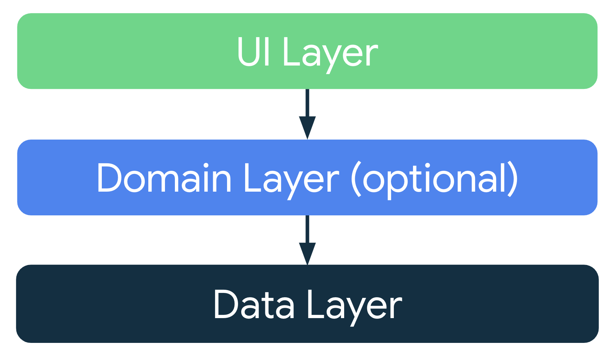

## I. Stages of the Activity lifecycle
In Android, an activity is the entry point for interacting with the user.

In the past, one activity would display one screen in an app. With current best practices, one activity might display multiple screens by swapping them in and out as needed.

### 1. Explore the lifecycle
Note: An Android app can have multiple activities. However, it is recommended to have a single activity.


Note: The asterisk on the onRestart() method indicates that this method is not called every time the state transitions between Created and Started. It is only called if onStop() was called and the activity is subsequently restarted.

```kotlin
import android.util.Log

private const val TAG = "MainActivity"

override fun onCreate(savedInstanceState: Bundle?) {
    // ...
    Log.d(TAG, "onCreate Called")
}
```

Note: When you override the onCreate() method, you must call the superclass implementation to complete the creation of the Activity, so within it, you must immediately call super.onCreate(). The same is true for other lifecycle callback methods.

Note that onStart()is paired with a corresponding onStop()lifecycle method. If the user starts your app and then returns to the device's home screen, the activity is stopped and is no longer visible on screen.

Use case 1: Opening and closing the activity
1. Open app: onCreate -> onStart -> onResume
2. Press back. Or Press overview: nothing, then slide to quit app: onPause -> onStop -> onDestroy (can't reproduce onDestroy yet)
The Android OS might close your activity if your code manually calls the activity's finish() method or if the user force-quits the app

Use case 2: Navigating away from and back to the activity
Ex: switch between apps, return home, start new apps, and handle interruptions by other activities such as phone calls. Your activity does not close down entirely: 
- When your activity is no longer visible on screen, the status is known as putting the activity into the background. The opposite of this is when the activity is in the foreground, or onscreen.
- When the user returns to your app, that same activity is restarted and becomes visible again. This part of the lifecycle is called the app's visible lifecycle.

1. Open app: onCreate -> onStart -> onResume
2. Press home. Or Press overview: nothing, then Press outside/hold long touch app or choose other app
  onPause -> onStop
3. Press app icon/overview: onRestart -> onStart -> onResume

When onPause() is called, the app no longer has focus. After onStop(), the app is no longer visible on screen. Although the activity is stopped, the Activity object is still in memory in the background. The Android OS has not destroyed the activity. The user might return to the app, so Android keeps your activity resources around.

Use case 3: Partially hide the activity

1. With the Dessert Clicker app running, click the **Share** button in the top right of the screen: onPause() is called.
2. Click outside the share dialog to return to the app, and notice that onResume() is called.


- onCreate() when the system creates the app.
- onStart() makes the app visible on the screen, but the user is not yet able to interact with it.
- onResume() brings the app to the foreground, and the user is now able to interact with it.
Despite the name, the onResume() method is called at startup, even if there is nothing to resume.

More : https://developer.android.com/reference/android/app/Activity#activity-lifecycle

### 2. Explore configuration changes

A configuration change occurs when the state of the device changes so radically that the easiest way for the system to resolve the change is to completely shut down and rebuild the activity. For example, if the user changes the device language, the whole layout might need to change to accommodate different text directions and string lengths. If the user plugs the device into a dock or adds a physical keyboard, the app layout may need to take advantage of a different display size or layout. And if the device orientation changes—if the device is rotated from portrait to landscape or back the other way—the layout might need to change to fit the new orientation.

Device rotation
1. Compile and run your app and open Logcat.
2. Click the cupcake a few times and note that the desserts sold and total revenue are not zero.
3. Ensure the screen rotation lock in the emulator is disabled.
4. Rotate the device or emulator to landscape mode. You can rotate the emulator left or right with the rotation buttons.

onCreate Called -> onStart Called -> onResume Called
onPause Called -> onStop Called -> onDestroy Called
onCreate Called -> onStart Called -> onResume Called

When the device is rotated, and the activity is shut down and re-created, the activity re-starts with default values—the dessert image, number of desserts sold, and total revenue reset back to zero.


#### Lifecycle of a composable
The UI of your app is initially built from running composable functions in a process called Composition.
Recomposition is when Compose re-executes the composable functions whose state might have changed and creates an updated UI

The only way to create or update a Composition is by its initial composition and subsequent recompositions.

Composable functions have their own lifecycle that is independent of the Activity lifecycle. Its lifecycle is composed of the events: enters the Composition, recomposing 0 or more times, and then leaving the Composition.

In order for Compose to track and trigger a recomposition, it needs to know when state has changed. To indicate to Compose that it should track an object's state, the object needs to be of type State or MutableState. The State type is immutable and can only be read. A MutableState type is mutable and allows reads and writes.

```kotlin
// trigger a recomposition when the revenue value changes
var revenue = mutableStateOf(0)

// remember value during recomposition 
var revenue by remember { mutableStateOf(0) }

// save value during configuration changes
var revenue by rememberSaveable { mutableStateOf(0) }
var currentDessertImageId by rememberSaveable {
    mutableStateOf(desserts[currentDessertIndex].imageId)
}
```

Reproduce above device rotation case, now the dessert image, desserts sold, and total revenue are restored to their previous values

Learn more
- [Log class](https://developer.android.com/reference/android/util/Log)
- [View logs with Logcat](https://developer.android.com/studio/debug/logcat)
- [Saveable API](https://developer.android.com/reference/kotlin/androidx/compose/runtime/saveable/package-summary)
- [Activity class](https://developer.android.com/reference/android/app/Activity.html)
- [ComponentActivity class](https://developer.android.com/reference/androidx/activity/ComponentActivity)
- [Activity Developer Guide](https://developer.android.com/guide/components/activities/intro-activities#kotlin)

## II. ViewModel and State Compose

### 1. App architecture
An app should have at least two layers:

- UI layer: a layer that displays the app data on the screen but is independent of the data.
- Data layer: a layer that stores, retrieves, and exposes the app data.
You can add another layer, called the domain layer, to simplify and reuse the interactions between the UI and data layers.



#### a. UI Layer

The UI layer is made up of the following components:

- UI elements: components that render the data on the screen. You build these elements using Jetpack Compose.
- State holders: components that hold the data, expose it to the UI, and handle the app logic. An example state holder is ViewModel.


#### b. ViewModel

ViewModel stores the app-related data that isn't destroyed when the activity is destroyed and recreated by the Android framework. Unlike the activity instance, ViewModel objects are not destroyed. The app automatically retains ViewModel objects during configuration changes so that the data they hold is immediately available after the recomposition.

#### c. UI State

UI is a result of binding UI elements on the screen with the UI state.


#### d. Immutability

Immutable objects provide guarantees that multiple sources do not alter the state of the app at an instant in time. This protection frees the UI to focus on a single role: reading state and updating UI elements accordingly. Therefore, you should never modify the UI state in the UI directly, unless the UI itself is the sole source of its data.

### 2. Add a ViewModel

```kotlin
// 1. Add dependency for ViewModel in build.gradle.kts (Module :app)
// This is used for adding the lifecycle aware viewmodel to your compose app
dependencies {
    implementation("androidx.lifecycle:lifecycle-viewmodel-compose:2.6.1")
}

// 2. Create a Kotlin class/file called GameViewModel 
import androidx.lifecycle.ViewModel

class GameViewModel : ViewModel() {
}

// 3. Create a Kotlin class/file for state UI called GameUiState
data class GameUiState(
   val currentScrambledWord: String = ""
)
```

#### a. StateFlow
StateFlow is a data holder observable flow that emits the current and new state updates. To update state and send it to the flow, assign a new value to the value property of the MutableStateFlow class.

```kotlin
import kotlinx.coroutines.flow.MutableStateFlow

// Game UI state
private val _uiState = MutableStateFlow(GameUiState())
```

#### b. Backing property
A backing property lets you return something from a getter other than the exact object.

```kotlin
// Declare private mutable variable that can only be modified
// within the class it is declared.
private var _count = 0 

// Declare another public immutable field and override its getter method. 
// Return the private property's value in the getter method.
// When count is accessed, the get() function is called and
// the value of _count is returned. 
val count: Int
    get() = _count
```

```kotlin
// 1. In the GameViewModel.kt file, add a backing property to uiState named _uiState. Name the property uiState and is of the type StateFlow<GameUiState>.
// Now _uiState is accessible and editable only within the GameViewModel. The UI can read its value using the read-only property, uiState. You can fix the initialization error in the next step.

import kotlinx.coroutines.flow.StateFlow
import kotlinx.coroutines.flow.asStateFlow

// Game UI state

// Backing property to avoid state updates from other classes
private val _uiState = MutableStateFlow(GameUiState())
val uiState: StateFlow<GameUiState> = _uiState.asStateFlow()
// The asStateFlow() makes this mutable state flow a read-only state flow.


// Set of words used in the game
private var usedWords: MutableSet<String> = mutableSetOf()

init {
   resetGame()
}

fun resetGame() {
   usedWords.clear()
   _uiState.value = GameUiState(currentScrambledWord = pickRandomWordAndShuffle())
}
```

### 3. Architecting your Compose UI

#### a. Unidirectional data flow
A unidirectional data flow (UDF) is a design pattern in which state flows down and events flow up.

The UI update loop for an app using unidirectional data flow looks like the following:

- Event: Part of the UI generates an event and passes it upward—such as a button click passed to the ViewModel to handle—or an event that is passed from other layers of your app, such as an indication that the user session has expired.
- Update state: An event handler might change the state.
- Display state: The state holder passes down the state, and the UI displays it.


#### b. Pass the data


The collectAsState() function collects values from this StateFlow and represents its latest value via State

```kotlin
import androidx.compose.runtime.collectAsState
import androidx.compose.runtime.getValue

@Composable
fun GameScreen(
   // ...
) {
    // Whenever there is a change in the uiState value, recomposition occurs for the composables using the gameUiState value
    val gameUiState by gameViewModel.uiState.collectAsState()
    // ...
}
```

Update flow
```kotlin
import kotlinx.coroutines.flow.update

if (userGuess.equals(currentWord, ignoreCase = true)) {
} else {
    // User's guess is wrong, show an error
    _uiState.update { currentState ->
        currentState.copy(isGuessedWordWrong = true)
    }
}
```
More code on Github: https://github.com/google-developer-training/basic-android-kotlin-compose-training-unscramble/tree/viewmodel

Learn more:
- [Guide to app architecture | Android Developers](https://developer.android.com/topic/architecture)
- [UI layer | Android Developers](https://developer.android.com/topic/architecture/ui-layer)
- [Manage state with Unidirectional Data Flow | Android Developers](https://developer.android.com/topic/architecture/ui-layer#udf)
- Learning Pathway: [Modern Android App Architecture](https://developer.android.com/courses/pathways/android-architecture)