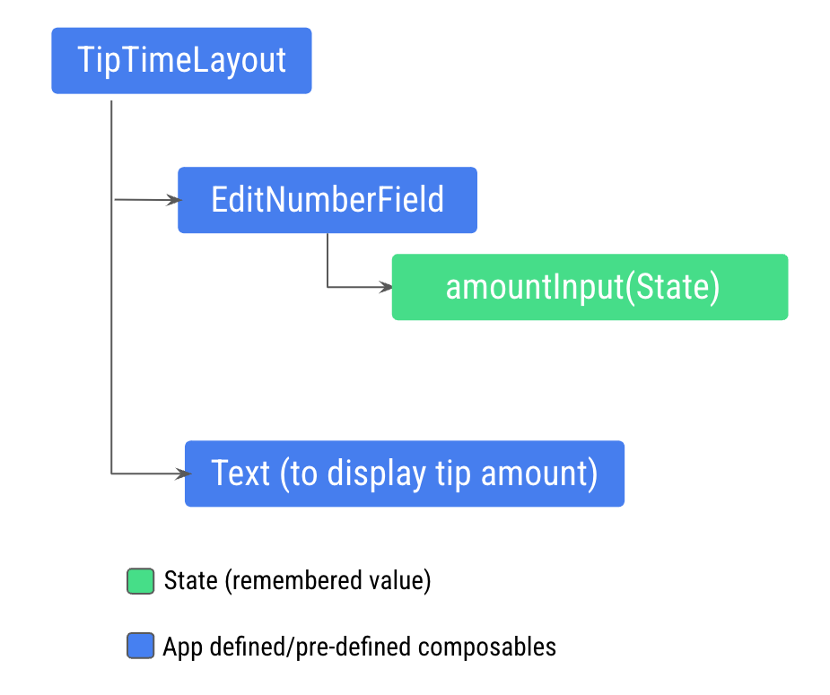
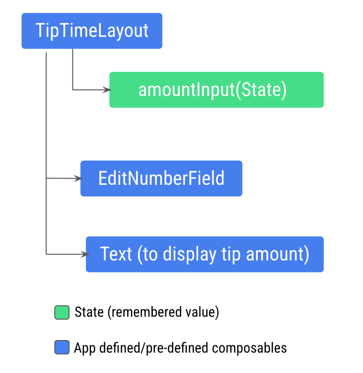
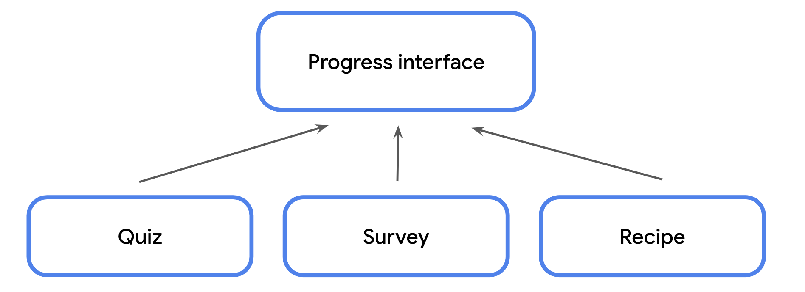
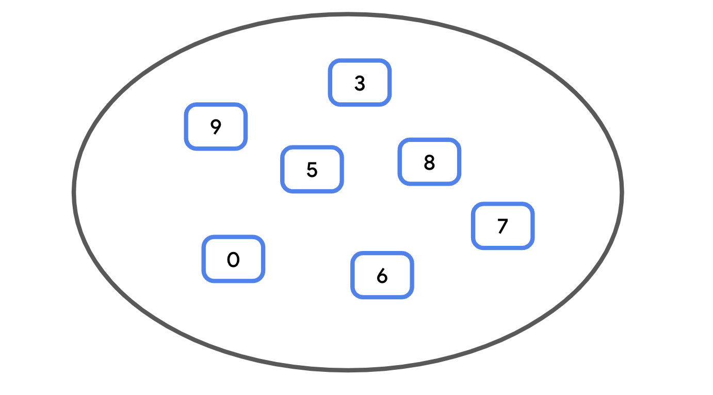
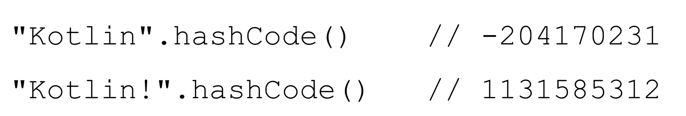
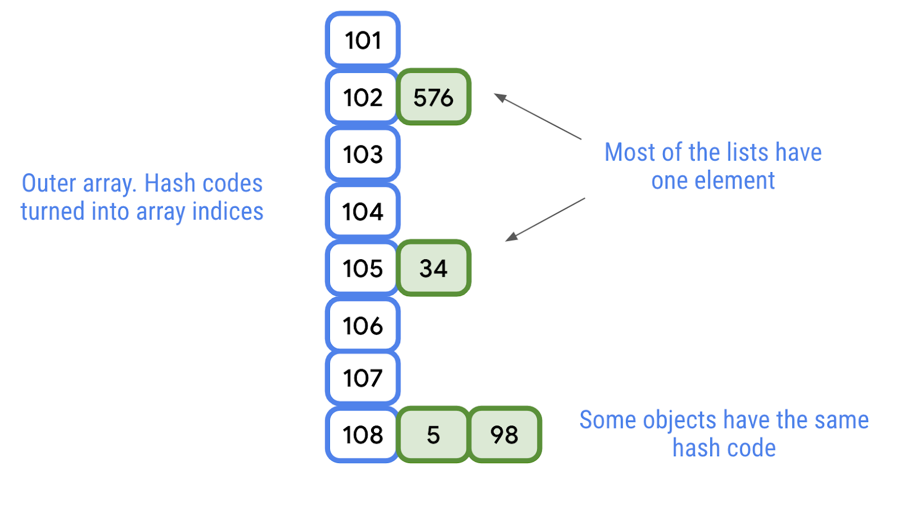
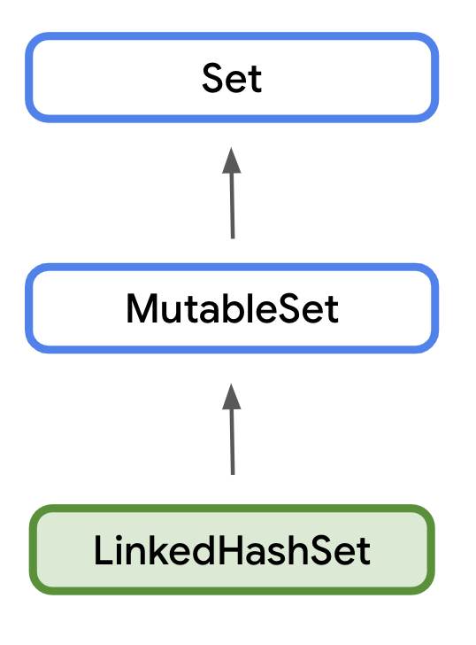
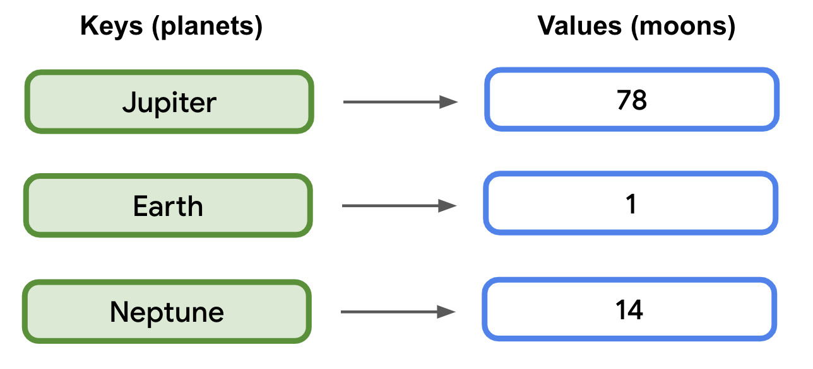

## Basic Kotlin

### 1. Data type
| Kotlin data type | What kind of data it can contain | Example literal values
|--------|---------|---------|
| String | Text | "Add contact" <br> "Search" <br> "Sign in" |
| Int | Integer number | 32 <br> 1293490 <br> -59281 |
| Double | Decimal number | 2.0 <br> 501.0292 <br> -31723.99999 |
| Float | Decimal number (that is less precise than a Double). Has an f or F at the end of the number. | 5.0f <br> -1630.209f <br> 1.2940278F |
| Boolean | true or false. Use this data type when there are only two possible values. Note that true and false are keywords in Kotlin. | true <br> false |

```kotlin 
val count: Int = 2
```

```kotlin
fun main() {
    val count: Int = 2
    println("You have $count unread messages.")
}
```

```You have 2 unread messages.```

```val``` keyword: *read-only*
```var``` keyword: *mutable*


**Warning**: Unlike in some languages, such as Java, where a function can change the value passed into a parameter, parameters in Kotlin are **immutable**. You cannot reassign the value of a parameter from within the function body


### 2. Annotation

```kotlin
@Composable
fun Greeting(name: String) {
    Text(text = "Hello $name!")
}
```

### 3. Trailing lambda syntax

```kotlin
fun name(parameter 1, parameter 2, ... function) {
  body
}
```

When you pass a function as that parameter, you can use trailing lambda syntax. Instead of putting the function inside the parentheses, you can place it outside the parentheses in curly braces

Example: 

```kotlin
Row(
    content = {
        Text("Some text")
        Text("Some more text")
        Text("Last text")
    }
)

// Use trailing lamda
Row {
    Text("Some text")
    Text("Some more text")
    Text("Last text")
}
```
### 4. Condition

```kotlin
fun main() {
    val x: Any = 20

    when (x) {
        2, 3, 5, 7 -> println("x is a prime number between 1 and 10.")
        in 1..10 -> println("x is a number between 1 and 10, but not a prime number.")
        is Int -> println("x is an integer number, but not between 1 and 10.")
        else -> println("x isn't an integer number.")
    }
}

fun main() {
    val trafficLightColor = "Black"

    val message = 
      if (trafficLightColor == "Red") "Stop"
      else if (trafficLightColor == "Yellow") "Slow"
      else if (trafficLightColor == "Green") "Go"
      else "Invalid traffic-light color"

    println(message)
}

fun main() {
    val trafficLightColor = "Amber"

    val message = when(trafficLightColor) {
        "Red" -> "Stop"
        "Yellow", "Amber" -> "Slow"
        "Green" -> "Go"
        else -> "Invalid traffic-light color"
    }
    println(message)
}
```

### 5. Null

Nullable types are variables that can hold null.
Non-null types are variables that can't hold null.

```kotlin
fun main() {
    // declare non-nullable variables
    var favoriteActor1: String = "Sandra Oh"
    favoriteActor1 = null // Error
    // Null can not be a value of non-null type String

    // declare nullable variables
    var favoriteActor: String? = "Sandra Oh"

    // ?. safe call operator
    favoriteActor = null
    println(favoriteActor?.length) // null

    // !!. not-null assertion operator
    favoriteActor = "Sandra Oh"
    println(favoriteActor!!.length) // 9

    // ?: Elvis operator
    val lengthOfName = favoriteActor?.length ?: 0 
    // get default value 0, if favoriteActor?.length is null
}
```

### 6. Store function in a variable

```kotlin
fun main() {
    // val trickFunction = trick 
    // Error: Function invocation 'trick()' expected

    // use the function reference operator (::)
    val trickFunction = ::trick
    trickFunction() // No treats!
}

fun trick() {
    println("No treats!")
}
```

Define a function with a lambda expression, you have a variable that refers to the function
=> no need the function reference operator ::
```kotlin
fun main() {
    val trickFunction = trick
    trick() // No treats!
    trickFunction() // No treats!
}

val trick = {
    println("No treats!")
}
```

### 7. Use function as a data type

(parameter (optional)) -> return type

```kotlin
val treat: () -> Unit = {
    println("Have a treat!")
}
```

Use a function as a return type
```kotlin
fun functionName(): functionType {
    // code
    return NameOfAnotherFunction
}
```
```kotlin
fun main() {
    val treatFunction = trickOrTreat(false)
    val trickFunction = trickOrTreat(true)
    treatFunction() // Have a treat!
    trickFunction() // No treats!
}

// Use a function as a return type
fun trickOrTreat(isTrick: Boolean): () -> Unit {
    if (isTrick) {
        return trick
    } else {
        return treat
    }
}

val trick = {
    println("No treats!")
}

val treat = {
    println("Have a treat!")
}
```

Pass a function to another function as an argument
```kotlin
val functionName = { parameter1, parameter2 ->
    // function body
}
```

```kotlin
fun main() {
    val coins: (Int) -> String = { quantity ->
        "$quantity quarters"
    }

    // val cupcake: (Int) -> String = { // quantity ->
    //    "Have a cupcake!"
    // }

    val treatFunction = trickOrTreat(false, coins)
    // val trickFunction = trickOrTreat(true, cupcake)
    val trickFunction = trickOrTreat(true, null)

    treatFunction()
    // 5 quarters
    // Have a treat!
    trickFunction() // No treats!
}

fun trickOrTreat(isTrick: Boolean, extraTreat: ((Int) -> String)?): () -> Unit {
    if (isTrick) {
        return trick
    } else {
        if (extraTreat != null) {
            println(extraTreat(5))
        }
        return treat
    }
}
```

### 8. Write lambda expressions with shorthand syntax

Omit parameter name
```kotlin
val coins: (Int) -> String = { quantity ->
    "$quantity quarters"
}

val coins: (Int) -> String = {
    "$it quarters"
}

fun main() {
    // val coins: (Int) -> String = { quantity ->
    //     "$quantity quarters"
    // }
    // val treatFunction = trickOrTreat(false, coins)

    // val treatFunction = trickOrTreat(false, { "$it quarters" })

    val treatFunction = trickOrTreat(false) { "$it quarters" }
    val trickFunction = trickOrTreat(true, null)
    treatFunction()
    trickFunction()
}
```

### 9. Use the repeat() function
When a function returns a function or takes a function as an argument, it's called a **higher-order function**.

The trickOrTreat() function is an example of a higher-order function 
because it takes a function of ((Int) -> String)? type as a parameter and returns a function of () -> Unit type

repeat() is higher-order function
```kotlin
for(iteration in start..end) {
    // code
}

repeat(times) { iteration ->
  // code
}
```

```kotlin
@Composable 
fun DiceWithButtonAndImage(modifier: Modifier = Modifier) {
}
```
You might wonder why you should bother to pass a **Modifier** argument at all when there's a default. The reason is because composables can undergo recomposition, which essentially means that the block of code in the @Composable method executes again. If a Modifier object is created in a block of code, it could potentially be recreated and that isn't efficient

Composables are **stateless** by default, which means that they don't hold a value and can be recomposed any time by the system, which results in the value being reset => use remember to store an object in memory
The mutableStateOf() function returns an observable => when the value of the result variable changes, a recomposition is triggered, the value of the result is reflected, and the UI refreshes
```kotlin
var result by remember { mutableStateOf(1) }
```

## Basic Android

### 1. There are two ways to run the debugger alongside your app:
1. Attach the debugger to an app process
- Click "Arrow Bug Icon" Attach Debugger to Android Process.
- Select **com.example.diceroller** and then click OK.
A Debug pane appears at the bottom of Android Studio with a message that indicates that the debugger is attached to the target device or emulator.

2. Run the app with the debugger
- In the Debug pane, click "Stop Icon", and then close the app on the device or emulator.
- Click "Bug Icon" Debug ‘app'.
The same Debug pane appears at the bottom of Android Studio with some console output.

### 2. Composition
The Composition is a description of the UI built by Compose when it executes composables. Compose apps call composable functions to transform data into UI.

If a state change happens, Compose re-executes the affected composable functions with the new state, which creates an updated UI—this is called recomposition.

The Composition can only be produced by an initial composition and updated by recomposition. The only way to modify the Composition is through recomposition.

You use the State (imutable) and MutableState (mutable) types in Compose to make state in your app observable, or tracked, by Compose

```kotlin
import androidx.compose.runtime.MutableState
import androidx.compose.runtime.mutableStateOf

var amountInput: MutableState<String> = mutableStateOf("0")
// Or
var amountInput = mutableStateOf("0")

// Warning: Creating a state object during composition without using remember.
// When user input new value, the EditNumberField() function recomposes, but its value still 0
// The composable resets its state during recomposition if it's not saved

TextField(
    value = amountInput.value,
    onValueChange = { amountInput.value = it },
    modifier = modifier
)
```
```kotlin
import androidx.compose.runtime.remember
import androidx.compose.runtime.getValue
import androidx.compose.runtime.setValue

@Composable
fun EditNumberField(modifier: Modifier = Modifier) {
    // Composable functions can store an object across recompositions with the remember
    var amountInput by remember { mutableStateOf("") }
    TextField(
        value = amountInput,
        onValueChange = { amountInput = it },
        modifier = modifier
    )
}
```
### 3. Composable
#### 3a. Stateless Composable
For example, you defined the amountInput variable as state in the EditNumberField() composable.

When your app becomes more complex and other composables need access to the state within the EditNumberField() composable, you need to consider hoisting, or extracting, the state out of the EditNumberField() composable function.


This structure won't let you display the tip amount in the new Text composable because the Text composable needs to access the amount variable calculated from the amountInput variable
You need to expose the amount variable to the TipTimeLayout() function. This image illustrates the desired code structure, which makes the EditNumberField() composable stateless:


This pattern is called state hoisting

Note: A stateless composable is a composable ​​that doesn't store its own state. It displays whatever state it's given as input arguments.

#### 3b. Understand stateful versus stateless composables
You should hoist the state when you need to:
- Share the state with multiple composable functions.
- Create a stateless composable that can be reused in your app.

State in an app is any value that can change over time.

A stateless composable is a composable ​​that doesn't store its own state, it displays whatever state it's given as input arguments.. On the other hand, a stateful composable is a composable that owns a piece of state that can change over time.

Note: In real apps, having a 100% stateless composable can be difficult to achieve depending on the composable's responsibilities. You should design your composables in a way that they will own as little state as possible and allow the state to be hoisted when it makes sense, by exposing it in the composable's API.

Note: The best practice is to provide a default Modifier parameter to all composable functions, which increases reusability. You should add it as the first optional parameter after all required parameters.

```kotlin
@Composable
fun TipTimeLayout() {
   var amountInput by remember { mutableStateOf("") }

   val amount = amountInput.toDoubleOrNull() ?: 0.0
   val tip = calculateTip(amount)
  
   Column(
       //...
   ) {
       //...
        EditNumberField(
          value = amountInput,
          onValueChange = { amountInput = it },
          modifier = Modifier
              .padding(bottom = 32.dp)
              .fillMaxWidth()
        )
        Text(
           text = stringResource(R.string.tip_amount, tip),
           style = MaterialTheme.typography.displaySmall
        )
   }
}

@Composable
fun EditNumberField(
   value: String,
   onValueChange: (String) -> Unit,
   modifier: Modifier = Modifier
) {
   TextField(
       value = value,
       onValueChange = onValueChange,
       singleLine = true,
       label = { Text(stringResource(R.string.bill_amount)) },
       keyboardOptions = KeyboardOptions(keyboardType = KeyboardType.Number),
       modifier = modifier
   )
}
```

### 4. Type of automated tests
#### 4a. Local tests
Local tests are a type of automated test that directly test a small piece of code to ensure that it functions properly. With local tests, you can test functions, classes, and properties. 
Local tests are executed on your workstation, which means they run in a development environment without the need for a device or emulator. This is a fancy way to say that local tests run on your computer. They also have very low overhead for computer resources, so they can run fast even with limited resources. Android Studio comes ready to run local tests automatically.

#### 4b. Instrumentation tests
For Android development, an instrumentation test is a UI test. Instrumentation tests let you test parts of an app that depend on the Android API, and its platform APIs and services.

Unlike local tests, UI tests launch an app or part of an app, simulate user interactions, and check whether the app reacted appropriately. Throughout this course, UI tests are run on a physical device or emulator.

When you run an instrumentation test on Android, the test code is actually built into its own Android Application Package (APK) like a regular Android app. An APK is a compressed file that contains all the code and necessary files to run the app on a device or emulator. The test APK is installed on the device or emulator along with the regular app APK. The test APK then runs its tests against the app APK.

```kotlin
private fun calculateTip(amount: Double, tipPercent: Double = 15.0, roundUp: Boolean): String

// Update for accessible from the test
@VisibleForTesting
internal fun calculateTip(amount: Double, tipPercent: Double = 15.0, roundUp: Boolean): String
```

#### 4c. Example Local Testing
- New > Directory > test/java
- New > Package > com.example.tiptime
- New > Kotlin Class/File, TipCalculatorTests class

Annotate the method with the @Test annotation. This lets the compiler know that the method is a test method and runs the method accordingly

```kotlin
package com.example.tiptime

import org.junit.Assert.assertEquals
import org.junit.Test
import java.text.NumberFormat

class TipCalculatorTests {

    @Test
    fun calculateTip_20PercentNoRoundup() {
        val amount = 10.00
        val tipPercent = 20.00
        val expectedTip = NumberFormat.getCurrencyInstance().format(2)
        val actualTip = calculateTip(amount = amount, tipPercent = tipPercent, false)
        assertEquals(expectedTip, actualTip)
    }
}
```

assertEquals()
assertNotEquals()
assertTrue()
assertFalse()
assertNull()
assertNotNull()
assertThat()

#### 4d. Example Instrumentation Testing

- New > Directory > androidTest/java
- New > Package > com.example.tiptime
- New > Kotlin Class/File > TipUITests class

Instrumentation tests test an actual instance of the app and its UI, so the UI content must be set, similar to how the content is set in the onCreate() method of the MainActivity.kt file when you wrote the code for the Tip Time app. You need to do this before you write all instrumentation tests for apps built with Compose.

```kotlin
package com.example.tiptime

import androidx.compose.foundation.layout.fillMaxSize
import androidx.compose.material3.Surface
import androidx.compose.ui.Modifier
import androidx.compose.ui.test.junit4.createComposeRule
import com.example.tiptime.ui.theme.TipTimeTheme
import org.junit.Rule
import org.junit.Test

import androidx.compose.ui.test.onNodeWithText
import androidx.compose.ui.test.performTextInput
import java.text.NumberFormat

class TipUITests {

    @get:Rule
    val composeTestRule = createComposeRule()

    @Test
    fun calculate_20_percent_tip() {
        composeTestRule.setContent {
            TipTimeTheme {
                Surface (modifier = Modifier.fillMaxSize()){
                    TipTimeLayout()
                }
            }
        }

        composeTestRule.onNodeWithText("Bill Amount").performTextInput("10")
        composeTestRule.onNodeWithText("Tip Percentage").performTextInput("20")

        val expectedTip = NumberFormat.getCurrencyInstance().format(2)
        composeTestRule.onNodeWithText("Tip Amount: $expectedTip").assertExists(
            "No node with this text was found."
        )
    }
}
```

### 5. What is a generic data type?
Generic types, or generics for short, allow a data type, such as a class, to specify an unknown placeholder data type that can be used with its properties and methods.

```kotlin
class ClassName <GenericDataType> {
  val propertyName: GenericDataType
}

val instance = ClassName<GenericDataType>(parameters)

// Example:
class FillInTheBlankQuestion(
    val questionText: String,
    val answer: String,
    val difficulty: String
)

class TrueOrFalseQuestion(
    val questionText: String,
    val answer: Boolean,
    val difficulty: String
)
class NumericQuestion(
    val questionText: String,
    val answer: Int,
    val difficulty: String
)

// Use Generic data type
class Question<T>(
    val questionText: String,
    val answer: T,
    val difficulty: String
)

fun main() {
    val question1 = Question<String>("Quoth the raven ___", "nevermore", "medium")
    val question2 = Question<Boolean>("The sky is green. True or false", false, "easy")
    val question3 = Question<Int>("How many days are there between full moons?", 28, "hard")
}
```

### 6. Enum

```kotlin
enum class Difficulty {
    EASY, MEDIUM, HARD
}

class Question<T>(
    val questionText: String,
    val answer: T,
    val difficulty: Difficulty
)

val question1 = Question<String>("Quoth the raven ___", "nevermore", Difficulty.MEDIUM)
val question2 = Question<Boolean>("The sky is green. True or false", false, Difficulty.EASY)
val question3 = Question<Int>("How many days are there between full moons?", 28, Difficulty.HARD)
```

### 7. Data Class

```kotlin
println(question1.toString()) // Question@37f8bb67

// add data keyword
data class Question<T>(
    val questionText: String,
    val answer: T,
    val difficulty: Difficulty
)

println(question1.toString())
// Question(questionText=Quoth the raven ___, answer=nevermore, difficulty=MEDIUM)
```

When a class is defined as a data class, the following methods are implemented.

- equals()
- hashCode(): you'll see this method when working with certain collection types.
- toString()
- componentN(): component1(), component2(), etc.
- copy()

Note: A data class needs to have at least one parameter in its constructor, and all constructor parameters must be marked with val or var. A data class also cannot be abstract, open, sealed, or inner.

### 8. Define a singleton object

A singleton object can't have a constructor as you can't create instances directly. Instead, all the properties are defined within the curly braces and are given an initial value.

```kotlin
object ObjectName {
  // class body
}

object StudentProgress {
    var total: Int = 10
    var answered: Int = 3
}

fun main() {
    println("${StudentProgress.answered} of ${StudentProgress.total} answered.")
    // 3 of 10 answered.
}

```

### 9. Declare objects as companion objects
Classes and objects in Kotlin can be defined inside other types, and can be a great way to organize your code. You can define a singleton object inside another class using a companion object. A companion object allows you to access its properties and methods from inside the class, if the object's properties and methods belong to that class, allowing for more concise syntax.

```kotlin
class Quiz {
    val question1 = Question<String>("Quoth the raven ___", "nevermore", Difficulty.MEDIUM)
    val question2 = Question<Boolean>("The sky is green. True or false", false, Difficulty.EASY)
    val question3 = Question<Int>("How many days are there between full moons?", 28, Difficulty.HARD)

    companion object StudentProgress {
        var total: Int = 10
        var answered: Int = 3
    }
}

fun main() {
    println("${Quiz.answered} of ${Quiz.total} answered.")
    // 3 of 10 answered.
}
```

### 10. Add an extension property
Note: Extension properties can't store data, so they must be get-only.

```kotlin
val Quiz.StudentProgress.progressText: String
    get() = "${answered} of ${total} answered"

fun main() {
    println(Quiz.progressText)
    // 3 of 10 answered.
}
```

### 11. Add an extension function
```kotlin
fun Quiz.StudentProgress.printProgressBar() {
    repeat(Quiz.answered) { print("▓") }
    repeat(Quiz.total - Quiz.answered) { print("▒") }
    println()
    println(Quiz.progressText)
}

fun main() {
    Quiz.printProgressBar()
    // ▓▓▓▒▒▒▒▒▒▒
    // 3 of 10 answered.
}
```

### 12. Interface


```kotlin
interface ProgressPrintable {
    val progressText: String
    fun printProgressBar()
}

class Quiz : ProgressPrintable {
    val question1 = Question<String>("Quoth the raven ___", "nevermore", Difficulty.MEDIUM)
    val question2 = Question<Boolean>("The sky is green. True or false", false, Difficulty.EASY)
    val question3 = Question<Int>("How many days are there between full moons?", 28, Difficulty.HARD)

    companion object StudentProgress {
        var total: Int = 10
        var answered: Int = 3
    }

    override val progressText: String
        get() = "${answered} of ${total} answered"
    
    override fun printProgressBar() {
        repeat(Quiz.answered) { print("▓") }
        repeat(Quiz.total - Quiz.answered) { print("▒") }
        println()
        println(progressText)
    }
}

fun main() {
    Quiz().printProgressBar()
    // ▓▓▓▒▒▒▒▒▒▒
    // 3 of 10 answered.
}
```

### 13. Use scope functions to access class properties and methods
https://kotlinlang.org/docs/scope-functions.html
- Replace long object names using let()
```kotlin
fun printQuiz() {
    println(question1.questionText)
    println(question1.answer)
    println(question1.difficulty)
    println()
    println(question2.questionText)
    println(question2.answer)
    println(question2.difficulty)
    println()
    println(question3.questionText)
    println(question3.answer)
    println(question3.difficulty)
    println()
}

// If the variable's name changed, you'd need to update every usage

fun printQuiz() {
    question1.let {
        println(it.questionText)
        println(it.answer)
        println(it.difficulty)
    }
    println()
    question2.let {
        println(it.questionText)
        println(it.answer)
        println(it.difficulty)
    }
    println()
    question3.let {
        println(it.questionText)
        println(it.answer)
        println(it.difficulty)
    }
    println()
}

fun main() {
    val quiz = Quiz()
    quiz.printQuiz()

    // Or Call apply() after the closing parenthesis when creating an instance of the Quiz class. 
    // You can omit the parentheses when calling apply(), and use trailing lambda syntax.
    Quiz().apply {
        printQuiz()
    } 

    /*
    Quoth the raven ___
    nevermore
    MEDIUM

    The sky is green. True or false
    false
    EASY

    How many days are there between full moons?
    28
    HARD
    */
}
```

## Colection
### - Array
Arrays store ordered data of the same type, and have a fixed size.

```kotlin
val rockPlanets = arrayOf<String>("Mercury", "Venus", "Earth", "Mars")
val gasPlanets = arrayOf("Jupiter", "Saturn", "Uranus", "Neptune")

val solarSystem = rockPlanets + gasPlanets
println(solarSystem[0]) // Mercury

solarSystem[3] = "Little Earth"
println(solarSystem[3]) // Little Earth
```

Arrays are used to implement many of the other collection types:
### 1. List - Mutable List
A list is an ordered, resizable collection, typically implemented as a resizable array.

```kotlin
fun main() {
    val solarSystem = listOf("Mercury", "Venus", "Earth", "Mars", "Jupiter", "Saturn", "Uranus", "Neptune")
    println(solarSystem.size) // 8

    for (planet in solarSystem) {
        println(planet)
    }
}
```

The ability to add, remove, and update elements in a collection is exclusive to classes that implement the MutableList interface

```kotlin
val solarSystem = mutableListOf("Mercury", "Venus", "Earth", "Mars", "Jupiter", "Saturn", "Uranus", "Neptune")

solarSystem.add("Pluto")
solarSystem.add(3, "Theia")
solarSystem[3] = "Future Moon"

println(solarSystem[3]) // Future Moon
println(solarSystem[9]) // Pluto

solarSystem.removeAt(9)
solarSystem.remove("Future Moon")

println(solarSystem.contains("Pluto")) // false
println("Future Moon" in solarSystem) // false
```

### 2. Sets - MutableSet
A set is a collection that does not have a specific order and does not allow duplicate values.

Note: Remember that sets are an unordered collection. There's no way to remove a value from a set by its index, as sets don't have indices.





- Searching for a specific element in a set is fast—compared with lists—especially for large collections.
- Sets tend to use more memory than lists for the same amount of data, since more array indices are often needed than the data in the set.



```kotlin
val solarSystem = mutableSetOf("Mercury", "Venus", "Earth", "Mars", "Jupiter", "Saturn", "Uranus", "Neptune")

println(solarSystem.size) // 8
solarSystem.add("Pluto")
println(solarSystem.size) // 9
println(solarSystem.contains("Pluto")) // true

solarSystem.add("Pluto") // Sets can't contain duplicates
println(solarSystem.size) // 9

solarSystem.remove("Pluto")
```

### 3. Map - MutableMap

Maps work similarly to sets and store pairs of keys and values of the specified type.
A map's keys are unique. A map's values, however, are not.



Accessing a value from a map by its key is generally faster than searching through a large list.

```kotlin
val solarSystem = mutableMapOf(
    "Mercury" to 0,
    "Venus" to 0,
    "Earth" to 1,
    "Mars" to 2,
    "Jupiter" to 79,
    "Saturn" to 82,
    "Uranus" to 27,
    "Neptune" to 14
)

println(solarSystem.size) // 8
solarSystem["Pluto"] = 5
println(solarSystem.size) // 9
println(solarSystem["Pluto"]) // 5
println(solarSystem.get("Theia")) // null

solarSystem.remove("Pluto")
println(solarSystem.size) // 8
```

### Higher-order functions with collections
Higher-order functions and lambdas
forEach()
map()
filter()
groupBy()
fold()
sortedBy()

