### I. Material Theming with Jetpack Compose
Material Design is a design system built and supported by Google designers and developers

#### 1. Color palette

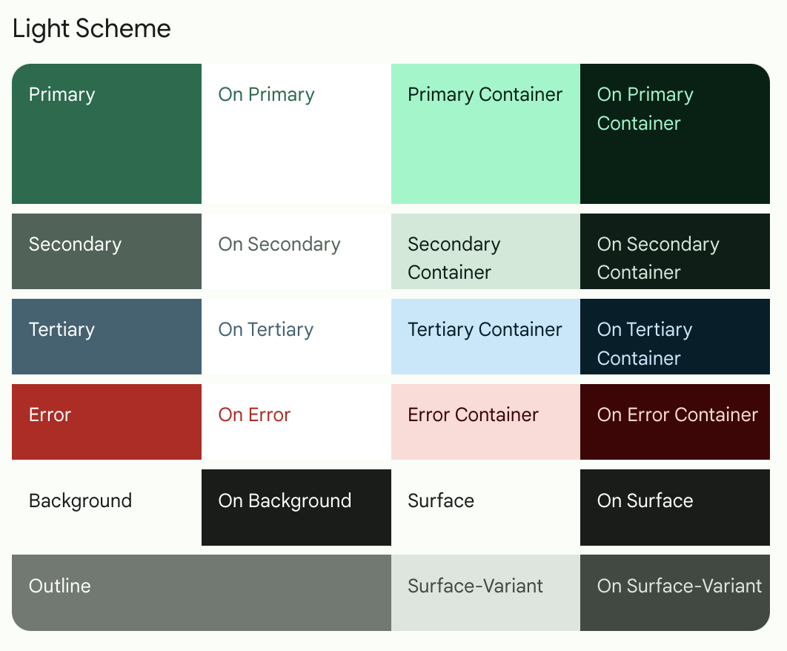
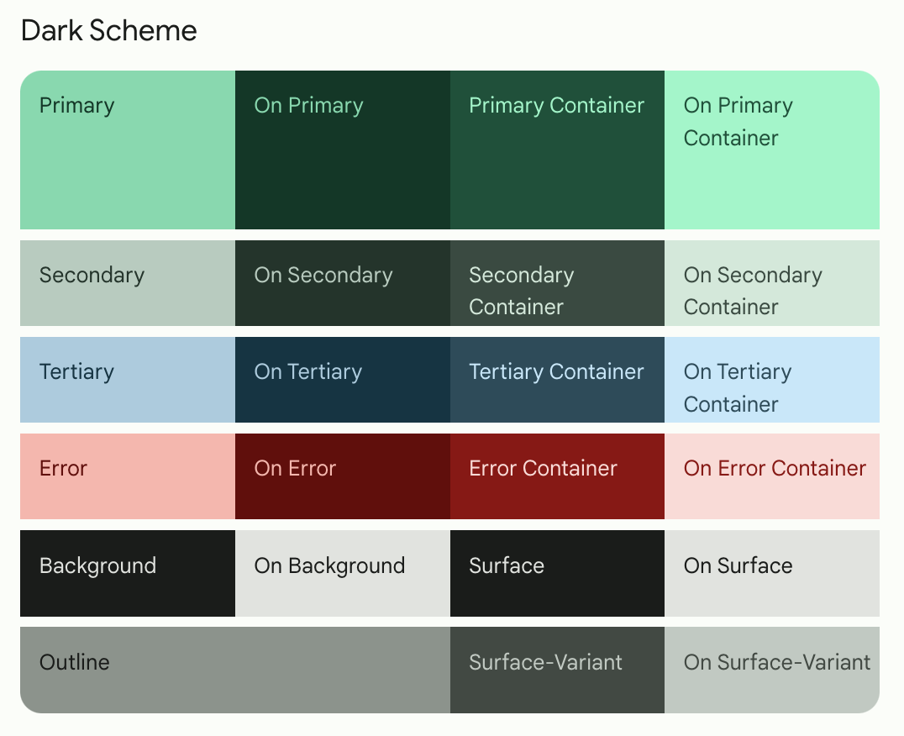

| Light Theme | Dark Theme |
|-------------|------------|
| 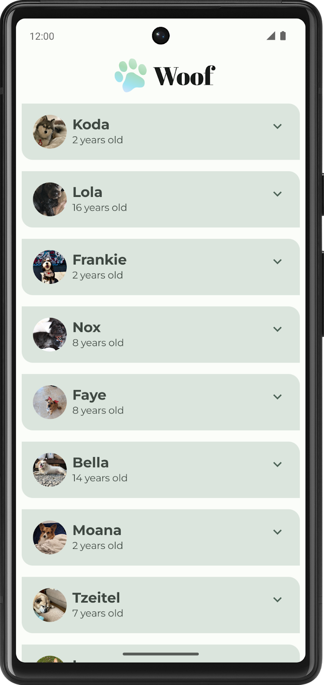 | 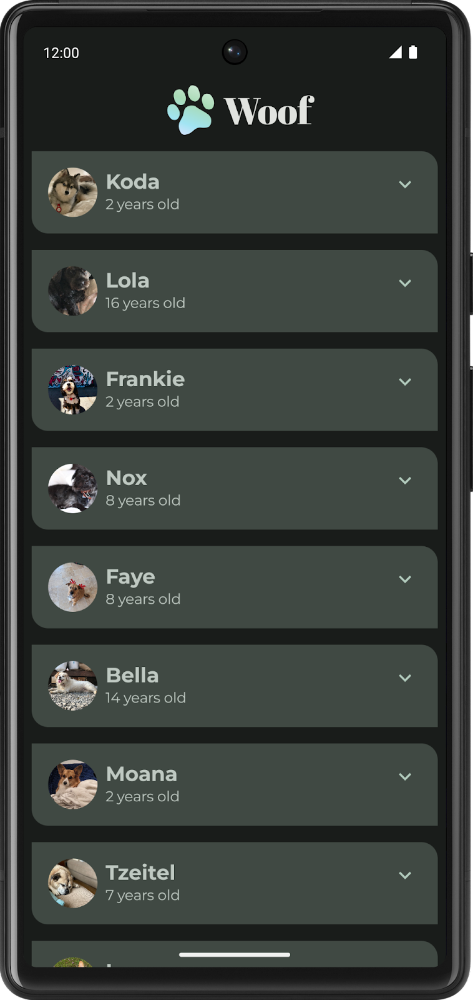|

#### 2. Typograhpy

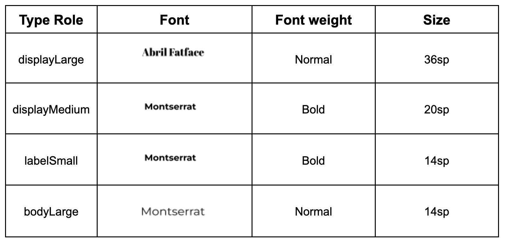

#### 3. Theme file

Theme.kt file is defined through colors, typography, and shapes
```kotlin
@Composable
fun WoofTheme(
    darkTheme: Boolean = isSystemInDarkTheme(),
    // Dynamic color is available on Android 12+
    dynamicColor: Boolean = false,
    content: @Composable () -> Unit
) {
    val colorScheme = when {
        dynamicColor && Build.VERSION.SDK_INT >= Build.VERSION_CODES.S -> {
            val context = LocalContext.current
            if (darkTheme) dynamicDarkColorScheme(context) else dynamicLightColorScheme(context)
        }

        darkTheme -> DarkColors
        else -> LightColors
    }
    val view = LocalView.current
    if (!view.isInEditMode) {
        SideEffect {
            setUpEdgeToEdge(view, darkTheme)
        }
    }

    MaterialTheme(
        colorScheme = colorScheme,
        shapes = Shapes,
        typography = Typography,
        content = content
    )
}

/**
 * Sets up edge-to-edge for the window of this [view]. The system icon colors are set to either
 * light or dark depending on whether the [darkTheme] is enabled or not.
 */
private fun setUpEdgeToEdge(view: View, darkTheme: Boolean) {
    val window = (view.context as Activity).window
    WindowCompat.setDecorFitsSystemWindows(window, false)
    window.statusBarColor = Color.Transparent.toArgb()
    val navigationBarColor = when {
        Build.VERSION.SDK_INT >= 29 -> Color.Transparent.toArgb()
        Build.VERSION.SDK_INT >= 26 -> Color(0xFF, 0xFF, 0xFF, 0x63).toArgb()
        // Min sdk version for this app is 24, this block is for SDK versions 24 and 25
        else -> Color(0x00, 0x00, 0x00, 0x50).toArgb()
    }
    window.navigationBarColor = navigationBarColor
    val controller = WindowCompat.getInsetsController(window, view)
    controller.isAppearanceLightStatusBars = !darkTheme
    controller.isAppearanceLightNavigationBars = !darkTheme
}
```

In MainActivity.kt, the WoofTheme() is added to provide the Material Theming for the entire app.

```kotlin
class MainActivity : ComponentActivity() {
   override fun onCreate(savedInstanceState: Bundle?) {
       super.onCreate(savedInstanceState)
       setContent {
           WoofTheme {
               Surface(
                   modifier = Modifier.fillMaxSize()
               ) {
                   WoofApp()
               }
           }
       }
   }
}
```

#### 4. Color Roles

The **primary** colors are used for key components across the UI.
The **secondary** colors are used for less prominent components in the UI.
The **tertiary** colors are used for contrasting accents that can be used to balance primary and secondary colors or bring heightened attention to an element, such as an input field.
The **on** color elements appear **on top** of other colors in the palette, and are primarily applied to text, iconography, and strokes. In our color palette, we have an **onSurface** color, which appears on top of the surface color, and an **onPrimary** color, which appears on top of the primary color.

More: https://m3.material.io/styles/color/roles

#### 5. The Material Design type scale
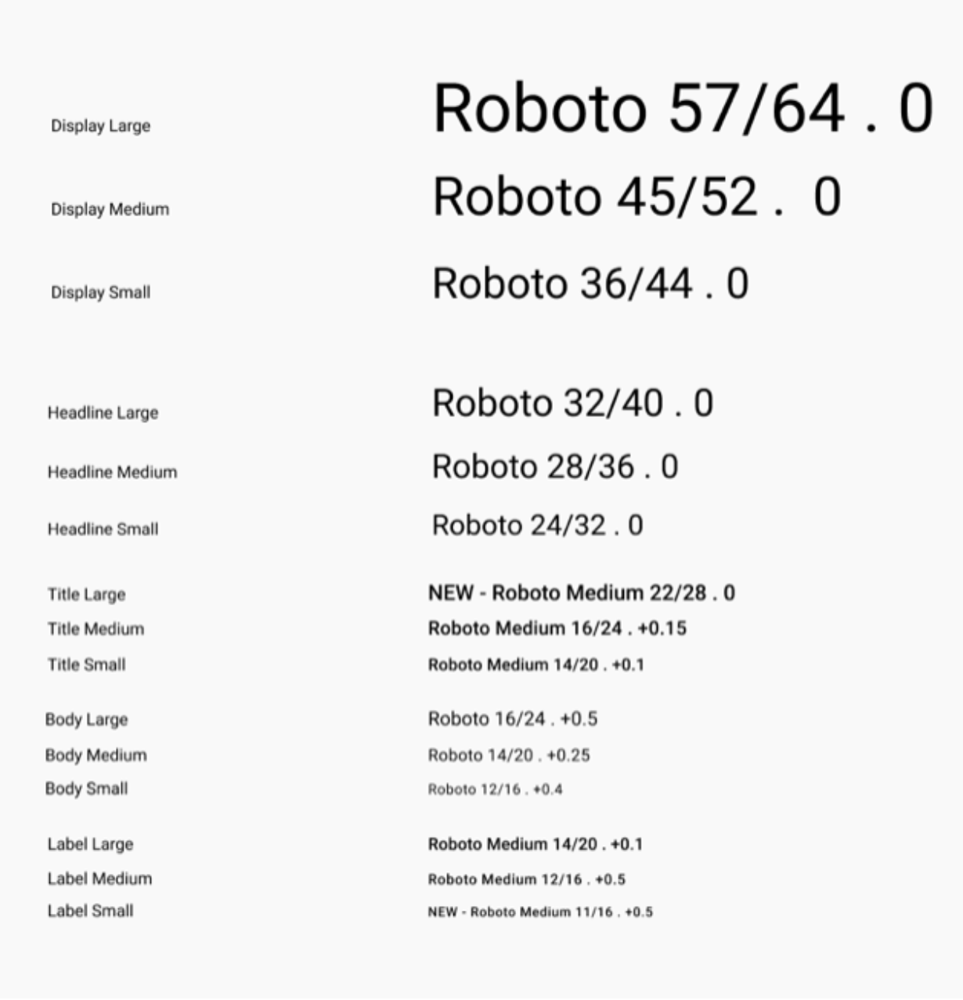

More: https://m3.material.io/styles/typography/type-scale-tokens

#### 6. Align the expand more button

**Modifier.weight()** sets the UI element's width/height proportionally to the element's weight, relative to its weighted siblings (other child elements in the row or column)

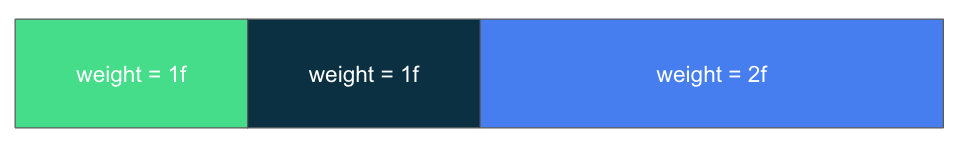

In the Woof app, each list item row contains a dog image, dog information, and an expand more button. You will add a *Spacer* composable before the expand more button with weight 1f to properly align the button icon. Since the spacer is the *only weighted child element* in the row, it will *fill the space remaining* in the row after measuring the other unweighted child elements' width.

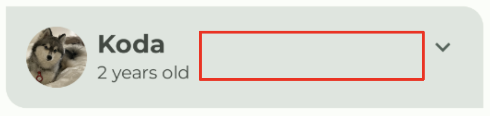


### II. Simple animation with Jetpack Compose

Spring force is guided by the following two properties:

Damping ratio: The bounciness of the spring.
Stiffness level: The stiffness of the spring, that is, how fast the spring moves toward the end.

| | |
|-----------------------|--------------------|
| 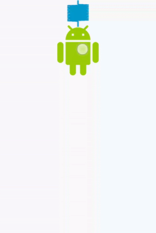 High Bounce | 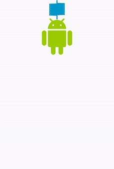 No Bounce |
| 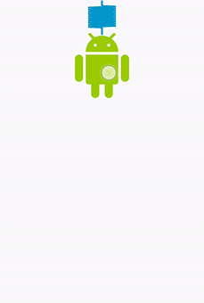 High Stiffness | 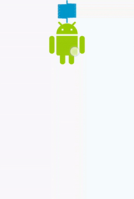 Very Low Stiffness |

More: https://developer.android.com/reference/kotlin/androidx/compose/animation/core/Spring

Chain the modifier with the **animateContentSize** modifier to animate the *size* (list item *height*) change
https://developer.android.com/develop/ui/compose/animation/composables-modifiers#animateContentSize

```kotlin
Column(
    modifier = Modifier.animateContentSize(
        animationSpec = spring(
            dampingRatio = Spring.DampingRatioNoBouncy,
            stiffness = Spring.StiffnessLow
        )
    )
) {
  // body
}
```

Add Color Animation when expanded
```kotlin
val color by animateColorAsState(
    targetValue = if (expanded) MaterialTheme.colorScheme.tertiaryContainer
    else MaterialTheme.colorScheme.primaryContainer,
    label = "ColorAnimation"
)

Column(
    modifier = Modifier
        .animateContentSize(
            // ...
        )
        .background(color = color)
) {
  // body
}
```
**Learn more:** (TO DO)
- [Jetpack Compose Animation](https://developer.android.com/develop/ui/compose/animation/introduction)
- Codelab: [Animating elements in Jetpack Compose](https://developer.android.com/codelabs/jetpack-compose-animation#0)
- Video: [Animation Reimagined](https://www.youtube.com/watch?v=Z_T1bVjhMLk)
- Video: [Jetpack Compose: Animation](https://www.youtube.com/watch?v=7yY2OocGiQU)

### III. Testing for Accessibility

**TalkBack** allows users to have eyes free control of their devices.
**Switch Access** allows users to navigate an app using switches instead of the touch screen.

https://developer.android.com/develop/ui/compose/accessibility

#### Contrast ratio
Tool: https://webaim.org/resources/contrastchecker
Small text has a recommended ratio of 4.5 : 1 and large text has a recommended ratio of 3.0 : 1.

Color design tools: https://m3.material.io/styles/color/system/overview

Learn more:
- [Accessibility on Android](https://www.youtube.com/playlist?list=PLWz5rJ2EKKc8OENfLdh3zM5T6IRdlVYKj)
- [Accessible design](https://m3.material.io/foundations/overview/principles)
- [Accessibility in Jetpack Compose](https://developer.android.com/codelabs/jetpack-compose-accessibility#0)
- [Make your Android app more accessible](https://developer.android.com/courses/pathways/make-your-android-app-accessible)