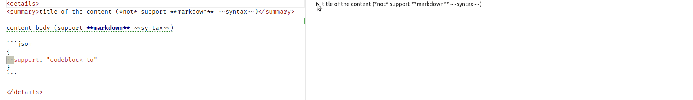
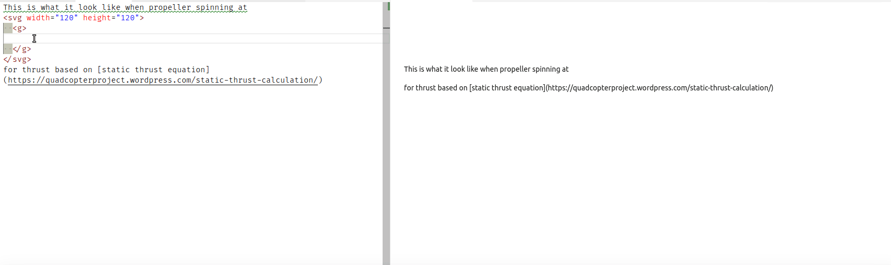
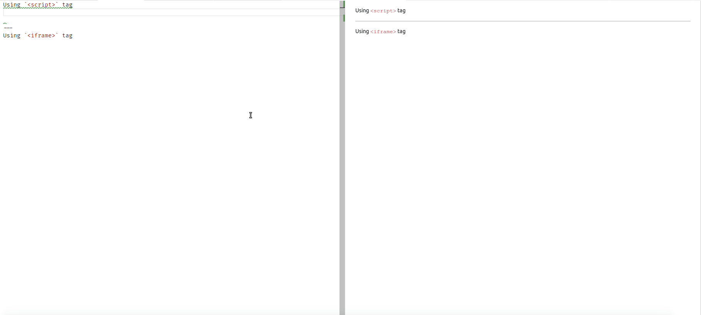

# Basic

### Markdown provides backslash escapes for the following characters:

```md
\   backslash
`   backtick
*   asterisk
_   underscore
{}  curly braces
[]  square brackets
()  parentheses
#   hash mark
+   plus sign
-   minus sign (hyphen)
.   dot
!   exclamation mark
```

### Header
```md
This is <h1> tag
================

This is <h2> tag
----------------

# This is <h1> tag also
###### This is <h6> tag
```


### Emphasized
```md
<blockquote><p>This is a blockquote.</p></blockquote>
> This is a blockquote.
```

```md
<em>are emphasized</em>
*are emphasized*
_are emphasized also_
```

```md
<strong>strong emphasis</strong>
**strong emphasis**
__two underscores strong emphasis also__
```

### List
```md
<ul><li>Candy.</li></ul>
*   Candy.
+   Candy.
-   Candy.
use asterisks, pluses, and hyphens (*, +, and -) as list markers
```

```md
<ol>
  <li>Red</li>
  <li>Green</li>
</ol>
1.  Red
2.  Green
```

### Link
```md
<p>Example link <a href="http://google.com/" title="Google">Google</a> and <a href="http://www.nytimes.com/">The New York Times</a> or <a href="http://fb.com/">Facebook</a>.</p>

Example name link [Google][1] and [The New York Times][NY Times] or [Facebook](http://fb.com/).

[1]: http://google.com/        "Google"
[ny times]: http://www.nytimes.com/
```

### Image
```md


Inline (titles are optional) or Reference-style:

![alt text][id]

[id]: /path/to/img.jpg "Title"
```

### Code
```md
<p>Example code <code>&lt;blink&gt;</code> tags or <code>&amp;mdash;</code>.</p>
Example code `<blink>` tags or `&mdash;`.
```

```md
<p>This is a normal paragraph:</p>
<pre><code>This is a code block by at least 4 spaces or 1 tab.</code></pre>

This is a normal paragraph:
    This is a code block by at least 4 spaces or 1 tab.
```

```md
<p>A single backtick in a code span: <code>`</code></p>
A single backtick in a code span: `` ` ``

<p>A backtick-delimited string in a code span: <code>`foo`</code></p>
A backtick-delimited string in a code span: `` `foo` ``
```

--------

# Advance

### Syntax Highlighting
```md
```javascript
function fancyAlert(arg) {
  if(arg) {
    $.facebox({div:'#foo'})
  }
}
​```
```

```javascript
function fancyAlert(arg) {
  if(arg) {
    $.facebox({div:'#foo'})
  }
}
```

### Task Lists
```md
- [x] @mentions, #refs, [links](), **formatting**, and <del>tags</del> supported
- [x] list syntax required (any unordered or ordered list supported)
- [x] this is a complete item
- [ ] this is an incomplete item
```

- [x] @mentions, #refs, [links](), **formatting**, and <del>tags</del> supported
- [x] list syntax required (any unordered or ordered list supported)
- [x] this is a complete item
- [ ] this is an incomplete item

### Tables
You can create tables by assembling a list of words and dividing them with hyphens - (for the first row), and then separating each column with a pipe |:

```md
First Header | Second Header
------------ | -------------
Content from cell 1 | Content from cell 2
Content in the first column | Content in the second column
```

First Header | Second Header
------------ | -------------
Content from cell 1 | Content from cell 2
Content in the first column | Content in the second column

### Using emoji Github
You can add emoji to your writing by typing :EMOJICODE:.

@octocat :+1: This PR looks great - it's ready to merge! :shipit:


Typing : will bring up a list of suggested emoji. The list will filter as you type, so once you find the emoji you're looking for, press Tab or Enter to complete the highlighted result.

For a full list of available emoji and codes, check out the [Emoji-Cheat-Sheet][emoji-link].

[emoji-link]: https://github.com/ikatyang/emoji-cheat-sheet/blob/master/README.md


--------

# Tricks

### Hide-show-content



<details>
<summary>title of the content (*not* support **markdown** syntax ~~hmm~~)</summary>

content body (support **markdown** syntax ~~hmm~~)

```json
{
  support: "codeblock to"
}
```
</details>

---------

### Nested codeblocks
This tricks use [zero-width-space][nested-1] on child codeblocks ( pair of ``` inside pair of ``` ). Usefull when I'm writing this tutorial.

[nested-1]: https://www.fileformat.info/info/unicode/char/200b/browsertest.htm


```md
some **markdown** content that *need* to be `displayed` in ~~plain text~~

```language
some code or syntax
​```

end
```

-------

### Combining italic, bold, superscript, subscript, and/or strikethrough


```md
italic-bold -> __*“ ssss”*__
superscript -> Starwars<sup>TM</sup>
superscript-italic -> Starwars<sup>*tm*</sup>
subscript -> F<sub>x</sub>
subscript-bold -> Limit<sub>**min**</sub>
italic-bold-strikethrough -> ~~__*“ ssss”*__~~
```

-------

### Quote long sentence
We can use nested blockquotes >> combined with italic for creating long sentence famous quote.


> **Sir Charles Antony Richard Hoare**
>> *“I call it my billion-dollar mistake.
It was the invention of the null reference in 1965.
At that time, I was designing the first comprehensive type system for references in an object oriented language ([ALGOL W](https://en.wikipedia.org/wiki/ALGOL_W)).
My goal was to ensure that all use of references should be absolutely safe, with checking performed automatically by the compiler.
But I couldn't resist the temptation to put in a null reference, simply because it was so easy to implement. This has led to innumerable errors, vulnerabilities, and system crashes, which have probably caused a billion dollars of pain and damage in the last forty years.”*

--------

### Aligning Image


```md
This is the code you need to align images to the left:


---
This is the code you need to align images to the center:
<center>
  
</center>

---
This is the code you need to align images to the right:

```

--------

### Animated Inline SVG
Instead of animated GIF, you can use animated SVG to draw an ilustration. Beware that this feature not supported in [IE, Microsoft Edge, and Android browsers prior to version 4.4](https://caniuse.com/svg-smil). Also, some website like [Github](https://github.com/isaacs/github/issues/316#issuecomment-67740023) doesn't allow inline SVG (and even uploading SVG image).



```html
This is what it look like when propeller spinning at
<svg width="120" height="120">
  <g transform="translate(0 30)">
    <rect fill="red" width="120" height="60" rx="60" ry="30" >
          <animateTransform attributeName="transform"
                          type="rotate"
                          from="0 60 30"
                          to="360 60 30"
                          dur="0.0059998800024"
                          repeatCount="indefinite"/>
    </rect>
    <rect fill="blue" width="120" height="60" rx="60" ry="30" >
      <animateTransform attributeName="transform"
                        type="rotate"
                        from="90 60 30"
                        to="450 60 30"
                        dur="0.0059998800024"
                        repeatCount="indefinite"/>
    </rect>
  </g>
  <text x="25%" y="10%">10 000 RPM</text>
  <text x="75%" y="90%">11 N</text>
</svg>
for thrust based on [static thrust equation](https://quadcopterproject.wordpress.com/static-thrust-calculation/)
```

-------

### Embed-share website/webapp
```md
Embedding website <iframe> or <script>. Not many website support this.
```



```md
Using `<script>` tag
<script src="https://gist.github.com/DrSensor/2b45a6eb516b6b8084a4866d10699113.js"></script>

---
Using `<iframe>` tag
<iframe src="https://codesandbox.io/embed/6zk98l6w0k" style="width:100%; height:500px; border:0; border-radius: 4px; overflow:hidden;" sandbox="allow-modals allow-forms allow-popups allow-scripts allow-same-origin"></iframe>
```
