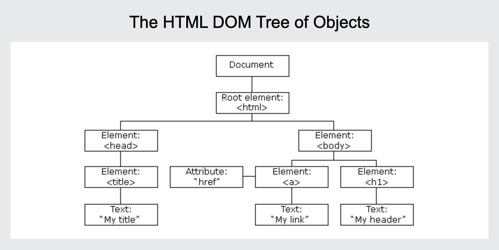

### HTML DOM

>Document Object Model

Gồm 3 thành phần:
1. Element
2. Attribute
3. Text

có thể gọi 3 thành phần trên với tên chung là Node

- Element: 
  1. id:
      - document.getElementById(id)             -> first
  2. class: 
      - document.getElementsByClassName(name)   -> list
  3. tag
      - document.getElementsByTagName(name)     -> list
  4. css selector
      - document.querySelector(query)           -> first
      - document.querySelectorAll(query)        -> list
  5. HTML collection
      1. document.forms - ex: document.forms["form-id"]
      2. document.images
      3. document.links
      4. document.title
      5. document.documentElement
      6. document.anchors
      7. document.body
      8. document.embeds
      9. document.head
      10. document.scripts