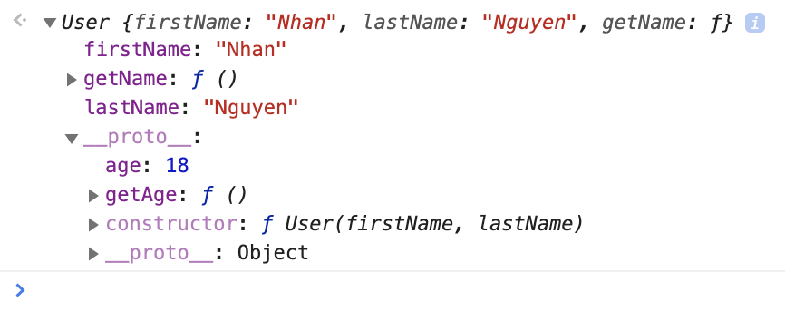

### Prefix & Postfix

> const a = 6;

```
const output = ++a; // output = a = 7

1: +1 cho a -> a = a + 1 = 7
>> 2: Trả về a sau khi +1
3: Gán output = a = 7;
```

```
const output = a++; // output = 6, a = 7

1: `a copy` = 6
2: +1 cho a => a = a + 1 = 7
>> 3: Trả về `a copy`
4: Gán output = `a copy` = 6
```

```
const output = a++ * 2 - a-- + ++a;

// a++ * 2  -> 6 * 2 = 12, a = 7
// a--      ->          7, a = 6 
// ++a      ->          7, a = 7
```

> x ** y = x<sup>y</sup>

### Convert to Boolean

- 0
- false
- ''
- undefined
- NaN
- null
> 6 giá trị trên -> false
>> còn lại -> true

### Toán tử logical
```
'A' && 1 > 0 && 'C'; // 'C'
'A' && NaN && 'C'; // NaN
Toán tử && chạy từ trái sang phải
nếu gặp kết quả của phép so sánh là "1 trong 6 ký tự false" -> trả về ký tự đó
nếu k gặp -> trả về kết quả của phép so sánh cuối cùng
```

```
'A' || 1 > 0 || 'C'; // 'A'
NaN || 'B' || 'C'; // 'B'
Toán tử || chạy từ trái sang phải, ngược lại
nếu gặp kết quả của phép so sánh là "không thuộc 6 ký tự false" -> trả về ký tự đó
nếu k gặp -> trả về kết quả của phép so sánh cuối cùng
```

### Data Type

1. Primitive Data - Dữ liệu nguyên thuỷ
   - Number
   - String
   - Boolean
   - Undefined
   - Null
   - Symbol   
  
```
    typeof null = object

    const id = Symbol('id); // unique
    const id2 = Symbol('id); // id sẽ khác id2
```

2. Complex Data - Dữ liệu phức tạp
   - Function
   - Object

> *"CPU để xử lý, RAM để lưu trữ giá trị khi phần thực thi"*

1. Primitive:

    let a = 1; 
    tạo ra vùng nhớ địa chỉ x -> lưu giá trị 1,
    không thể sửa lại giá trị ở vùng nhớ x nữa
    
    a = 2; 
    tạo ra vùng nhớ y khác -> lưu giá trị 2

2. Complex:


### Function

>   Delaration function có thể gọi trước khi khai báo (hoisting)

>   còn Expression function thì không

```javascript
    declarationFunc(); // ok

    function declarationFunc () {}

    const expressionFunc = function () {}
    setTimeout(function() {}) // Expression function
    const myObject = {
        expressionFunc: function () {}
    }

    const arrowFunc = () => {}
```

### Object

```javascript
    const ageKey = 'age';

    myObject = {
        name: 'Nhan'
        'e-mail': 'test@mail.com',
        [ageKey]: 18,
        getName: function () {
            return this.name;
        }
    }
    myObject.name = myObject['name'];
    myObject.age = myObject[ageKey];

    delete myObject.age;
```

### Object constructor

```javascript
    function User (firstName, lastName) {
        this.firstName = firstName;
        this.lastName = lastName;

        this.getName = function () {
            return `${this.firstName} ${this.lastName}`;
        }
    }

    const user = new User('Nhan', 'Nguyen');

    /**
     * prototype
     * 
     * dùng để thêm property/method cho constructor
     * 
     * console.log thì thấy nó nằm trong __proto__ 
     * chứ không nằm trên như các property/method đã định nghĩa trong constructor
     * 
     * user.hasOwnProperty(firstName); // true
     * user.hasOwnProperty(age); // false
     * 
     * xem hình để thấy thêm chi tiết
     * */ 

    User.prototype.age = 18;
    User.prototype.getAge = function () {
        return this.age;
    }
```


### Loop
 - for 
 - for/in
 - for/of
 - do/while
 - while
  
```javascript
    for(let i = 0; i < array.length; i++) {}

    // Tránh mỗi lần loop phải đi tính lại array.length thì:
    const arrayLength = array.length;
    for(let i = 0; i < arrayLength; i++) {}

    // key
    for (const property in object) {}
    for (const index in array) {}
    for (const index in string) {}

    // value
    for (const value of array) {}
    for (const element of array) {}
    for (const char of string) {}

    // break, continue

    /**
     * nên for/in để tránh case length > độ dài thực tế
     * 
     * const array = new Array(10);
     * array empty nhưng length = 10
     * 
     * hoặc bị ai đó set lại length
     * array.length = 10;
     * */
```

This, call, apply, bind

In most cases, the value of this is determined by how a function is called (runtime binding). It can't be set by assignment during execution, and it may be different each time the function is called.

- Global context

```javascript
    // In web browsers, the window object is also the global object:
    console.log(this === window); // true

    a = 37;
    console.log(window.a); // 37

    this.b = "MDN";
    console.log(window.b)  // "MDN"
    console.log(b)         // "MDN"
```

- Function context
  
Inside a function, the value of this depends on how the function is called.
```javascript
    function f1() {
        return this;
    }

    // In a browser:
    f1() === window; // true

    // In Node:
    f1() === globalThis; // true
```

In strict mode
```javascript
    function f2() {
        'use strict'; // see strict mode
        return this;
    }

    f2() === undefined; // true
```
- Class context

Similar function context. But Static methods are not properties of this. They are properties of the class itself.

```javascript
    class Example {
        constructor() {
            const proto = Object.getPrototypeOf(this);
            console.log(Object.getOwnPropertyNames(proto));
        }
        first(){}
        second(){}
        static third(){}
    }

    new Example(); // ['constructor', 'first', 'second']
```

- Derived classes

Unlike base class constructors, derived constructors have no initial this binding. Calling  super() creates a this binding within the constructor and essentially has the effect of evaluating the following line of code, where Base is the inherited class:

```javascript
    this = new Base();
```

> Warning: Referring to this before calling super() will throw an error.

Derived classes must not return before calling super(), unless they return an Object or have no constructor at all.

```javascript
    class Base {}
    class Good extends Base {}
    class AlsoGood extends Base {
    constructor() {
        return {a: 5};
    }
    }
    class Bad extends Base {
    constructor() {}
    }

    new Good();
    new AlsoGood();
    new Bad(); // ReferenceError
```

Examples

#### 'this' in function contexts

```javascript
// An object can be passed as the first argument to call or apply and this will be bound to it.
var obj = {a: 'Custom'};

// We declare a variable and the variable is assigned to the global window as its property.
var a = 'Global';

function whatsThis() {
  return this.a;  // The value of this is dependent on how the function is called
}

whatsThis();          // 'Global' as this in the function isn't set, so it defaults to the global/window object
whatsThis.call(obj);  // 'Custom' as this in the function is set to obj
whatsThis.apply(obj); // 'Custom' as this in the function is set to obj
```

#### this and object conversion

```javascript
function add(c, d) {
  return this.a + this.b + c + d;
}

var o = {a: 1, b: 3};

// The first parameter is the object to use as
// 'this', subsequent parameters are passed as
// arguments in the function call
add.call(o, 5, 7); // 16

// The first parameter is the object to use as
// 'this', the second is an array whose
// members are used as the arguments in the function call
add.apply(o, [10, 20]); // 34
```

Note that in non–strict mode, with call and apply, if the value passed as this is not an object, an attempt will be made to convert it to an object. Values null and undefined become the global object. Primitives like 7 or 'foo' will be converted to an Object using the related constructor, so the primitive number 7 is converted to an object as if by new Number(7) and the string 'foo' to an object as if by new String('foo'), e.g.

```javascript
function bar() {
  console.log(Object.prototype.toString.call(this));
}

bar.call(7);     // [object Number]
bar.call('foo'); // [object String]
bar.call(undefined); // [object global]
```

#### The bind method

ECMAScript 5 introduced Function.prototype.bind(). Calling f.bind(someObject) creates a new function with the same body and scope as f, but where this occurs in the original function, in the new function it is permanently bound to the first argument of bind, regardless of how the function is being used.

```javascript
function f() {
  return this.a;
}

var g = f.bind({a: 'azerty'});
console.log(g()); // azerty

var h = g.bind({a: 'yoo'}); // bind only works once!
console.log(h()); // azerty

var o = {a: 37, f: f, g: g, h: h};
console.log(o.a, o.f(), o.g(), o.h()); // 37,37, azerty, azerty
```

var obj = {
  name: "a",
  getName: () => {
    return this.name
  }
}
### Arrow function

1. Does not have its own bindings to 'this' or 'super', and should not be used as [methods](https://developer.mozilla.org/en-US/docs/Glossary/Method).
2. Does not have arguments, or new.target keywords.
3. Not suitable for call, apply and bind methods, which generally rely on establishing a scope.
4. Can not be used as constructors.
5. Can not use yield, within its body.
   
In arrow functions, this retains the value of the enclosing lexical context's this. In global code, it will be set to the global object:

```javascript
var globalObject = this;
var foo = (() => this);
console.log(foo() === globalObject); // true
```

> Note: If this arg is passed to call, bind, or apply on invocation of an arrow function it will be ignored. You can still prepend arguments to the call, but the first argument (thisArg) should be set to null.

```javascript
// Call as a method of an object
var obj = {func: foo};
console.log(obj.func() === globalObject); // true

// Attempt to set this using call
console.log(foo.call(obj) === globalObject); // true

// Attempt to set this using bind
foo = foo.bind(obj);
console.log(foo() === globalObject); // true
```

No matter what, foo's this is set to what it was when it was created (in the example above, the global object). The same applies to arrow functions created inside other functions: their this remains that of the enclosing lexical context.

```javascript
// Create obj with a method bar that returns a function that
// returns its this. The returned function is created as
// an arrow function, so its this is permanently bound to the
// this of its enclosing function. The value of bar can be set
// in the call, which in turn sets the value of the
// returned function.
var obj = {
  bar: function() {
    var x = (() => this);
    return x;
  }
};

// Call bar as a method of obj, setting its this to obj
// Assign a reference to the returned function to fn
var fn = obj.bar();

// Call fn without setting this, would normally default
// to the global object or undefined in strict mode
console.log(fn() === obj); // true

// But caution if you reference the method of obj without calling it
var fn2 = obj.bar;
// Calling the arrow function's this from inside the bar method()
// will now return window, because it follows the this from fn2.
console.log(fn2()() == window); // true
```

#### As an object method

When a function is called as a method of an object, its this is set to the object the method is called on.

In the following example, when o.f() is invoked, inside the function this is bound to the o object.

```javascript
var o = {
  prop: 37,
  f: function() {
    return this.prop;
  }
};

console.log(o.f()); // 37
```

Note that this behavior is not at all affected by how or where the function was defined. In the previous example, we defined the function inline as the f member during the definition of o. However, we could have just as easily defined the function first and later attached it to o.f. Doing so results in the same behavior:

```javascript
var o = {prop: 37};

function independent() {
  return this.prop;
}

o.f = independent;

console.log(o.f()); // 37

o.b = {g: independent, prop: 42};
console.log(o.b.g()); // 42
```

#### 'this' on the object's prototype chain

```javascript
var o = {f: function() { return this.a + this.b; }};
var p = Object.create(o);
p.a = 1;
p.b = 4;

console.log(p.f()); // 5
```

```javascript
function sum() {
  return this.a + this.b + this.c;
}

var o = {
  a: 1,
  b: 2,
  c: 3,
  get average() {
    return (this.a + this.b + this.c) / 3;
  }
};

Object.defineProperty(o, 'sum', {
    get: sum, enumerable: true, configurable: true});

console.log(o.average, o.sum); // 2, 6
```

```javascript
/*
 * Constructors work like this:
 *
 * function MyConstructor(){
 *   // Actual function body code goes here.
 *   // Create properties on |this| as
 *   // desired by assigning to them.  E.g.,
 *   this.fum = "nom";
 *   // et cetera...
 *
 *   // If the function has a return statement that
 *   // returns an object, that object will be the
 *   // result of the |new| expression.  Otherwise,
 *   // the result of the expression is the object
 *   // currently bound to |this|
 *   // (i.e., the common case most usually seen).
 * }
 */

function C() {
  this.a = 37;
}

var o = new C();
console.log(o.a); // 37

function C2() {
  this.a = 37;
  return {a: 38};
}

o = new C2();
console.log(o.a); // 38
```

#### In an inline event handler

When the code is called from an inline on-event handler, its this is set to the DOM element on which the listener is placed:

```html
<button onclick="alert(this.tagName.toLowerCase());">
  Show this
</button>
```
The above alert shows button. Note however that only the outer code has its this set this way:

```html
<button onclick="alert((function() { return this; })());">
  Show inner this
</button>
```

In this case, the inner function's this isn't set so it returns the global/window object (i.e. the default object in non–strict mode where this isn't set by the call).

#### this in classes

Just like with regular functions, the value of this within methods depends on how they are called. Sometimes it is useful to override this behavior so that this within classes always refers to the class instance. To achieve this, bind the class methods in the constructor:

```javascript
    class Car {
    constructor() {
        // Bind sayBye but not sayHi to show the difference
        this.sayBye = this.sayBye.bind(this);
    }
    sayHi() {
        console.log(`Hello from ${this.name}`);
    }
    sayBye() {
        console.log(`Bye from ${this.name}`);
    }
    get name() {
        return 'Ferrari';
    }
    }

    class Bird {
    get name() {
        return 'Tweety';
    }
    }

    const car = new Car();
    const bird = new Bird();

    // The value of 'this' in methods depends on their caller
    car.sayHi(); // Hello from Ferrari
    bird.sayHi = car.sayHi;
    bird.sayHi(); // Hello from Tweety

    // For bound methods, 'this' doesn't depend on the caller
    bird.sayBye = car.sayBye;
    bird.sayBye();  // Bye from Ferrari
```
> Note: Classes are always strict mode code. Calling methods with an undefined this will throw an error

[Call](https://developer.mozilla.org/en-US/docs/Web/JavaScript/Reference/Global_Objects/Function/call),
[apply](https://developer.mozilla.org/en-US/docs/Web/JavaScript/Reference/Global_Objects/Function/apply),
[bind](https://developer.mozilla.org/en-US/docs/Web/JavaScript/Reference/Global_Objects/Function/bind)


- Mutable (trạng thái - thay đổi được)
- Immutable (trạng thái - không thay đổi được)
  + Cách bộ nhớ lưu trữ và sử dụng biến:
  + Bộ nhớ chương trình gồm có 2 thành phần là địa chỉ bộ nhớ và dữ liệu được lưu trữ trong bộ nhớ đó.
  + Khi có một phép toán như phép gán `test = 3`, rõ ràng bộ nhớ cần lưu trữ chữ test và giá trị 3 của nó vào bộ nhớ:

  | Địa chỉ bộ nhớ | Giá trị ô nhớ 1 | Giá trị ô nhớ 2 |
  | -------------- | --------------- | --------------- |
  | xxx1           | test            |                 |
  | xxx2           | 3               |                 |
  | xxx0           | xxx1            | xxx2            |

- Phép toán `test = test * 2` khi nào là **mutable**, khi nào là **immutable**?

  1. Phép toán trên được xem là **mutable** khi bộ nhớ thành như sau:

  | Địa chỉ bộ nhớ | Giá trị ô nhớ 1 | Giá trị ô nhớ 2 |
  | -------------- | --------------- | --------------- |
  | xxx1           | test            |                 |
  | xxx2           | 6               |                 |
  | xxx0           | xxx1            | xxx2            |

  2. Phép toán trên được xem là **immutable** khi bộ nhớ thành như sau:

  | Địa chỉ bộ nhớ | Giá trị ô nhớ 1 | Giá trị ô nhớ 2 |
  | -------------- | --------------- | --------------- |
  | xxx1           | test            |                 |
  | xxx2           | 3               |                 |
  | xxx3           | 6               |                 |
  | xxx0           | xxx1            | xxx3            |

  - Như bạn thấy, khi giá trị của biến **không bị ghi đè** mà được copy sang một nơi khác thì đó mới là **immutable** , từ giá trị ở định nghĩa này chính là giá trị đi với ô nhớ.

- Khi nào nên dùng **mutable**:
  > Khi cần thay đổi một biến trong vòng lặp thì bạn nên dùng **mutable**

  + Nếu lặp n phần tử mà ta dùng immutable như sau:
  ```java
  String s = ""; // String là immutable
  for (int i = 0; i < n; ++i) {
      s = s + n; // phải copy biến s cũ thành object khác rồi mới gán vào s mới được
  }
  // Cứ mỗi lần copy s cũ là phải lặp số ký tự có trong s cũ để copy
  // dẫn tới thời gian tính toán của thuật toán là O(n²)
  ```

  + Ta có thể cải thiện thuật toán trên bằng cách sử dụng mutable:
  ```java
  StringBuilder sb = new StringBuilder();
  for (int i = 0; i < n; ++i) {
    sb.append(String.valueOf(n));
  }

  String s = sb.toString();
  ```

- Khi nào nên dùng **immutable**: 
  + Trong đa số các trường hợp, bạn nên dùng **immutable** 
  + vì immutable dễ hiểu và không xảy ra bug liên quan tới **reference** 
    còn mutable khiến cho code không tuân theo luồng suy nghĩ của lập trình viên, khó đọc, dễ gây bug khó chịu liên quan tới reference.
  + VD **mutable** gây bug:
  ```java
    /** @return the sum of the numbers in the list */
  public static int sum(List<Integer> list) {
      int sum = 0;
      for (int x : list)
          sum += x;
      return sum;
  }

  /** @return the sum of the absolute values of the numbers in the list */
  public static int sumAbsolute(List<Integer> list) {
      // let's reuse sum(), because DRY, so first we take absolute values
      for (int i = 0; i < list.size(); ++i)
          list.set(i, Math.abs(list.get(i)));
      return sum(list);
  }

  public static void main(String[] args) {
      // ...
      List<Integer> myData = Arrays.asList(-5, -3, -2);
      System.out.println(sumAbsolute(myData)); // hàm sumAbsolute() đã làm mảng myData
      System.out.println(sum(myData)); // nên hàm sum() không còn gọi đúng với myData ban đầu như dự kiến nữa
  }
  ```

  + VD **immutable** trong React:
  ```javascript
  // Action type
  const GET_STUDENT = 'GET_STUDENT';
  const ADD_STUDENT = 'ADD_STUDENT';

  // Reducer
  const studentInitialState = {
      students: [],
      slelectedStudent: {}
  };

  function studentData (state = studentInitialState, action) {
    const newState = Object.assign({}, state);
    // Tạo ra bản copy của state cũ, thay vì sử dụng Mutable state
    
    switch (action.type) {
        case GET_STUDENTS:
            newState.students = action.students
        case ADD_STUDENT:
            newState.students = [...state.students, action.student];
        default:
            return state;
    }
    return newState;
  }
```
- Để `GET_STUDENTS` hoặc `ADD_STUDENT`, mình tạo một **newState** và thực hiện những thay đổi bằng cách sử dụng `Object.assign` và cuối cùng trả về **newState** chứ không phải là state cũ để có thể đảm bảo trạng thái của nó.